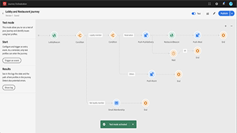

# Tutorial su Journey Orchestration

[!UICONTROL Journey Orchestration] è un servizio applicativo integrato con Adobe Experience Platform. Consente di applicare l’orchestrazione in tempo reale per diversi casi d’uso, sfruttando i dati contestuali provenienti da eventi o origini dati.

## Proposte del nostro staff

<table>
<tr>
  <td>
    
    

      <a href="./understanding-journey-orchestration.md">
    <strong>Journey Orchestration: cos’è e come funziona</strong>
    </a>
    

    

    <em>Comprendi il concetto di Journey Orchestration, possibili casi d'uso e gli elementi chiave del suo funzionamento.</em>
    

  </td>
  <td>
    
    

      <a href="./building-a-journey/creating-a-journey.md">
    <strong>Creare un percorso (video)</strong>
    </a>
    

    

    <em>Scopri come creare un nuovo percorso, iniziare da un evento, utilizzare le orchestrazioni per controllare il flusso e la tempistica di un percorso e utilizzare le azioni per interagire con gli utenti lungo il percorso.</em>
    

  </td>
  <td>
   
    

      <a href="./analyze-a-journey-via-reporting-tools.md">
    <strong>Analizzare un percorso tramite Strumenti di reporting</strong>
    </a>
    

    

    <em>Scopri come passare al reporting per il tuo percorso, come personalizzare intervalli di date per il tuo reporting e come salvare un modello di reporting per utilizzi futuri. </em>
    

  </td>
</tr>
</table>

## Risorse aggiuntive

* [Centro Risorse Journey Orchestration](https://experienceleague.adobe.com/docs/journeys/using/journey-orchestration-home.html?lang=it)
* [Tutorial su Adobe Experience Platform](https://experienceleague.adobe.com/docs/platform-learn/tutorials/overview.html?lang=it)
